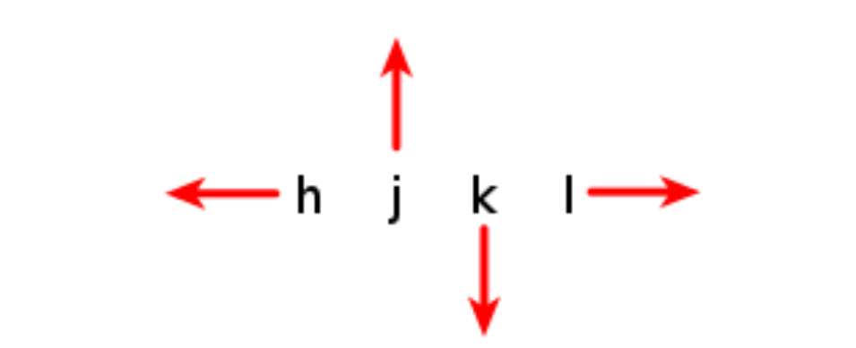

## Editing Files with Vi

### What You Will Learn

*****

* How to use the vi editor.

### The Vi Editor

*****

* Has advanced and powerful features.
* Not intutive(`易懂的;使用简便的`).
* Harder to learn than Nano.
* Requires a time investment(`投资;投资额`).

Command | Description
:--: | :--:
`vi [file]` | edit file
`vim [file]` | Same as vi, but more features
`view [file]` | Starts vim in read-only mode

### Vi Command Mode and Navigation

*****

Command | Description
:--: | :--:
`k` | Up one line
`j` | Down one line
`h` | Left one character
`l` | Rigth one character
`w` | Rigth one word
`b` | left one word
`$` | Go to the end of the line

### Vi Navigation Keys

*****

### Vi Insert Mode

*****

Command | Description
:--: | :--:
`i` | Insert at the cursor position
`I` | Insert at the beginning of the line
`a` | Append after the cursor position
`A` | Append at the end of the line

### Vi Line Mode

*****

Command | Description
:--: | :--:
`:w` | Writes(Saves) the file
`:w!` | Forces the file to be saved
`:q` | Quit
`:q!` | Quit without saving changes
`:wq!` | Write and quit
`:x` | Same as :wq
`:n` | Positions the cursor at line n
`:$` | Postitins the cursor on the lase line
`:set nu` | Turn on line numbering
`:set nonu` | Turn off line numbering
`:help [subcommand]` | Get help

### Vi Modes

*****

Mode | Key
:--: | :--:
Command | Esc
Insert | IiAa
Line | :

### Vi - Repeating Commands

*****

* Repeat a command by preceding it with a number.
  * `5k` = Move up 5 times
  * `80i<Text><Esc>` = Insert <Text> 80 times
  * `80i_<Esc>` = Insert 80 "\_" characters 

### Vi - Deleting Text

*****

Command | Description
:--: | :--:
`x` | Delete a character
`dw` | Delete a word
`dd` | Delete a line
`D` | Delete from the currect position

### Vi - Changing Text

*****

Command | Description
:--: | :--:
`r` | Replace the current character
`cw` | Change the current word
`cc` | Change the current line
`c$` | Change the text from the current position
`C` | Same as `c$`
`~` | Reverses the case of the character

### Vi - Copying and Pasting

*****

Command | Description
:--: | :--:
`yy` | Yank(copy) the current line
`y <position>` | Yank the position
`p` | Paste the most recent deleted or yanked text

### Vi - Undo / Redo

*****

Command | Description
:--: | :--:
`u` | Undo
`Ctrl + R` | Redo

### Vi - Searching

*****

Command | Description
:--: | :--:
`/<pattern>` | Start a forward search
`?<pattern>` | Start a reverse search