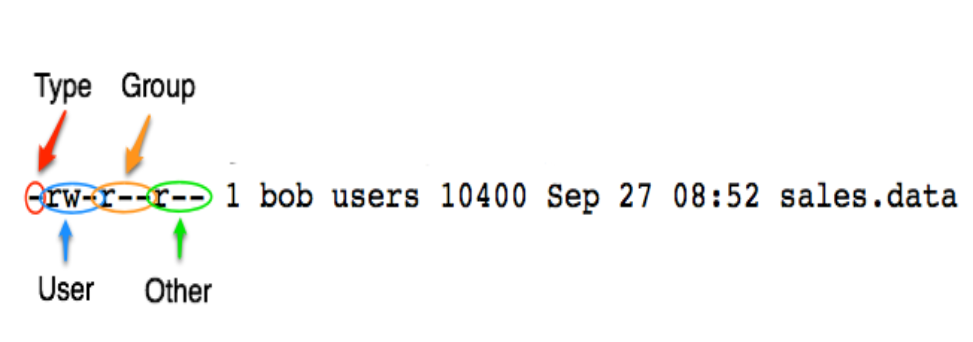

## File and Directory Permissions Explained

### What You Will Learn

*****

* Symbolic permissions
* Numberic or octal(`八进制`) permissions
* File versus directory permissions
* Changing permissions
* Working with groups
* File creation mask

### Permissions

*****

```
$ ls -l
-rw-rw-r-- 1 jason users 10400 Sep 27 08:52 sales.data
```

Symbol|Type
:--:|:--:
\-|Regular File
d|Directory
l|Symbolic link
r|Read
w|Write
x|Execute

### Permissions - Files vs Directories

*****

Permission | File | Directory
:--: | :--: | :--: 
Read(r) | Allows a file to read. | Allows file names in the directory to be read.
Write(w) | Allows a file to modified. | Allows entries to be modified within the directory.
Execute(x) | Allows the execution of a file. | Allows access to contents and metadata for entries.

### Permission Categories

*****

Symbol | Category
:--: | :--:
u | User
g | Group
o | Other
a | All

### Groups

*****

* Every user is in at least one group.
* Users can belong to many groups. 
* Groups are used to organize(`组织;筹备;安排;处理;分配;规划;管理;照料`) users.
* The `groups` command displays a user's groups.
* You can also use `id -Gn`.

### Secret Decoder Ring

*****



### Changing Permissions

*****

Item | Meaning
:--: | :--:
chmod | Change mode command
ugoa | User category: user, group, other, all
+-= | Add subtract or set permissions
rwx | Read, write, execute

### Numberic Based Permissions

*****

r | w | x | meaning
:--: | :--: | :--: | :--:
0 | 0 | 0 | Value for off
1 | 1 | 1 | Binary value for on
4 | 2 | 1 | Base 10 value for on

Octal | Binary | String | Description
:--: | :--: | :--: | :--:
0 | 0 | --- | No permissions
1 | 1 | --x | Execute only
2 | 10 | -w- | Write only
3 | 11 | -wx | Execute and write
4 | 100 | r-- | Read only
5 | 101 | r-x | Read and execute
6 | 110 | rw- | Read and write
7 | 111 | rwx | Read, write, and execute

### Order Has Meaning

*****

Type | U | G | O
:--: | :--: | :--: | :--:
Symbolic | rwx | r-x | r--
Binary | 111 | 101 | 100
Decimal | 7 | 5 | 4

### Commonly Used Permissions

*****

Symbolic | Octal
:--: | :--:
-rwx------ | 700
-rwxr-xr-x | 755
-rw-rw-r-- | 664
-rw-rw---- | 660
-rw-r--r-- | 644

### Working with Groups

*****

* New file belong to your primary group.
* The `chgrp` command changes the group.

### Directory Permissions Revisited

*****

* Permissions on a Directory can effect the files in the directory.
* If the file permissions look correct, start checking directory permissions.
* Work your way up to the root.

### File Creation Mask

*****

* File Creation mask determines default permissions.
* If no mask were used permissions would be :
  * 777 for directories
  * 666 for files

### The umask Command

```
umask [-S] [mode]
```

* Sets the file creation mask to  mode, if given.
* Use -S to for Symbolic notation.

Type | Directory | File
:--: | :--: | :--:
Base Permission | 777 | 666
Subtract Umask | -007 | -007
Creations Permission | 770 | 660

### Specil Modes

*****

* umask `0022` is the same as umask `022`
* `chmod 0644` is the same as `chmod 644`
* The specil modes are: 
  * setuid
  * setgid
  * sticky