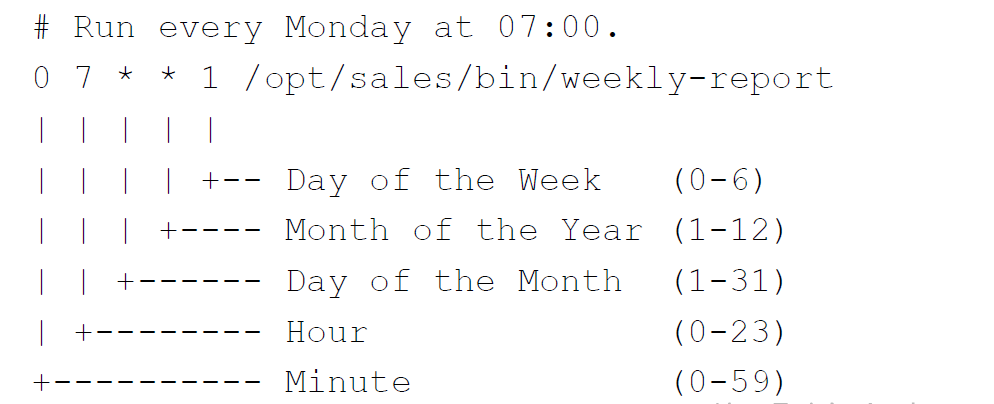

## Scheduling Repeaded Jobs with Cron

### What You Will Learn

*****

* Cron service
* Crontab format
* Crontab command

### Cron

*****

* cron - A time based job scheduling service.
* crontab - A program to create, read, update, and delete your job schedules
* Use cron to schedule and automate tasks

### Crontab Format

*****


### Example Crontab Entry

*****

```
# Run every Monday at 7:00 .
0 7 * * 1 /opt/sales/bin/weeekly-report
```


### Redirecting Output

*****

```
# Run at 2:00 every day and send output to a log file.
0 2 * * * /root/backupdb > /tmp/db.log 2>&1
```

### Example Crontab Entries

*****

```
# Run every 30 minutes.
0,30 * * * * /opt/acme/bin/half-hour-check
# Another way to do the same thing.
*/2 * * * * /opt/acme/bin/half-hour-check
# Run for the first 5 minutes of the hour
0-4 * * * * /opt/acme/bin/first-five-mins
```

### Crontab Shortcuts

*****

@yearly ------ 0 0 1 1 *
@annually ---- 0 0 1 1 *
@monthly ----- 0 0 1 * *
@weekly ------ 0 0 * * 0
@daily ------- 0 0 * * *
@midnight ---- 0 0 * * *
@hourly ------ 0 * * * *

### Using the crontab Command

*****

Command | Description
:--: | :--:
`crontab file` | Install a new crontab from file
`crontab -l` | List your cron jobs
`crontab -e` | Edit your cron jobs
`crontab -r` | Remove all of your cron jobs