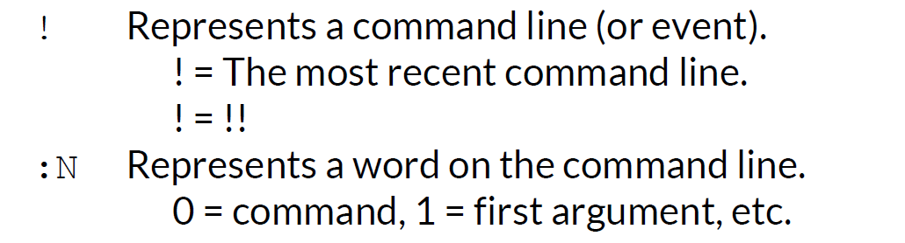
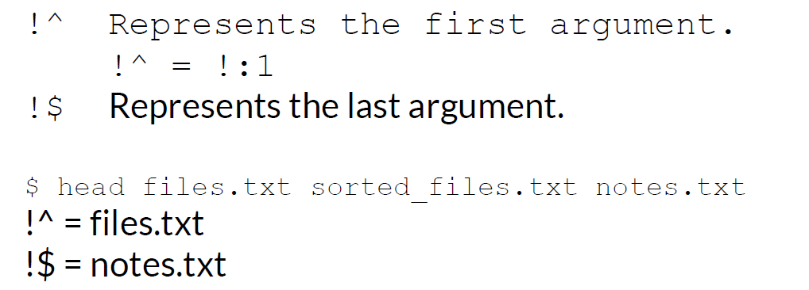

## Shell History and Autocompletion

### What You Will Learn

*****

* Shell history
* Exclamation(`感叹号`) Mark Syntax(`语法`)
* Autocompletion

### Shell History

***** 

* Executed commands are added to the history
* Shell history can be displayed and recalled
* Shell history is stored in memory and on disk
  * \~/.bash_history
  * \~/.history
  * \~/.histfile

### history Command

*****

```
# Display the shell history
$ history

# HISTSIZE - Controls the number of commands to retain in history 
export HISTSIZE=1000
```

### ! Syntax

*****

Command | Description
:--: | :--:
`!N` | Repeat command line number N
`!!` | Repeat the previous command line
`!string` | Repeat the most recent command starting with "string"

### More ! Syntax 

*****

```
# <Event> <Separator> <Word>
!:N
```


### ! Syntax Examples

*****

```
$ head files.txt sorted_files.txt notes.txt
<Output from head command here>
$ !!
head files.txt sorted_files.txt notes.txt
<Output from head command here>
$ vi !:2
vi sorted_files.txt
<vi editor starts>
```

### Even More ! Syntax

*****



### Searching Shell History

*****

Command | Description
:--: | :--:
Ctrl-r | Reverse shell history search
Enter | Execute the command
Arrows | Change the command
Ctrl-g | Cancel the search

### Tab Completion

*****

Tab - Autocompletion commands, files, directories, path, Environminet variables, usernames(~)